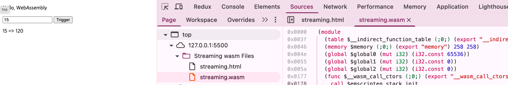
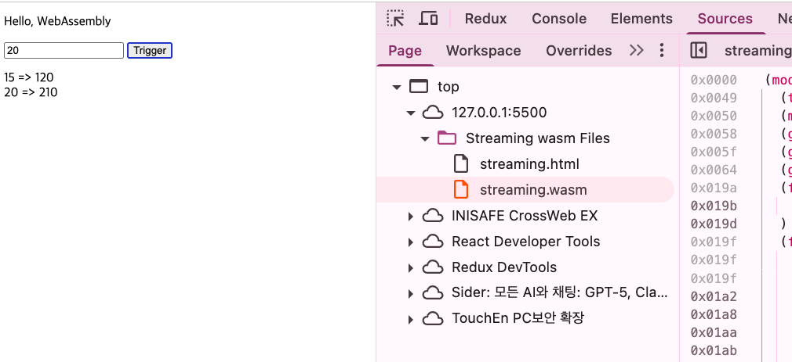

## js파일 없이 모듈 가져오기 (wasm 파일 사용)


```c
#include <emscripten.h>

EMSCRIPTEN_KEEPALIVE
int sumOfNInts(int n)
{
  return n * (n + 1) / 2;
}

```

```html
<!DOCTYPE html>
<html lang="en">
<head>
  <meta charset="UTF-8">
  <meta name="viewport" content="width=device-width, initial-scale=1.0">
  <title>Streaming</title>
</head>
<body>
  <p>Hello, WebAssembly</p>

  <script>
    function run_wasm() {
      WebAssembly.instantiateStreaming(
        fetch('streaming.wasm'), {}
      ).then(results => {
        var a = document.querySelector('#a').value;
        var sum = results.instance.exports.sumOfNInts(a);
        document.querySelector('#ret').innerHTML += `${a} => ${sum}<br />`
      });
    }
  </script>

  <input type="number" id="a">

  <button onClick="run_wasm()">Trigger</button>
  <p id="ret"></p>
</body>
</html>
```

> js 모듈을 불러오지 않았음에도 사용 가능하다.

## exports로 불러오기
```html
<!DOCTYPE html>
<html lang="en">
<head>
  <meta charset="UTF-8">
  <meta name="viewport" content="width=device-width, initial-scale=1.0">
  <title>Streaming</title>
</head>
<body>
  <p>Hello, WebAssembly</p>

  <script>
    var exports;
    WebAssembly.instantiateStreaming(
      fetch("streaming.wasm"), {}
    ).then((results) => exports = results.instance.exports);

    function run_wasm() {
      var a = document.querySelector('#a').value;
      var sum = exports.sumOfNInts(a);

      document.querySelector('#ret').innerHTML += `${a} => ${sum}<br />`;
    }
  </script>

  <input type="number" id="a">

  <button onClick="run_wasm()">Trigger</button>
  <p id="ret"></p>
</body>
</html>
```

> trigger하지 않아도 먼저 wasm을 불러옴



## 여러 C 파일 컴파일한 후 wasm 사용하기
```c
/// streaming_util.c
#include <emscripten.h>

EMSCRIPTEN_KEEPALIVE
int add(int a, int b)
{
  return a + b;
}

EMSCRIPTEN_KEEPALIVE
int sub(int a, int b)
{
  return a - b;
}

EMSCRIPTEN_KEEPALIVE
int mul(int a, int b)
{
  return a * b;
}

EMSCRIPTEN_KEEPALIVE
int idiv(int a, int b)
{
  return a / b;
}
```

```c
/// streaming.c
#include <emscripten.h>

int add(int a, int b);
int sub(int a, int b);
int mul(int a, int b);
int idiv(int a, int b);

EMSCRIPTEN_KEEPALIVE
int sumOfNInts(int n)
{
  return idiv(mul(n, add(n, 1)), 2);
}

```



