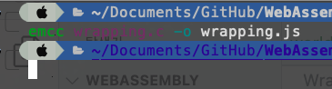
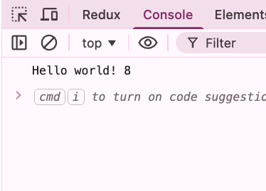
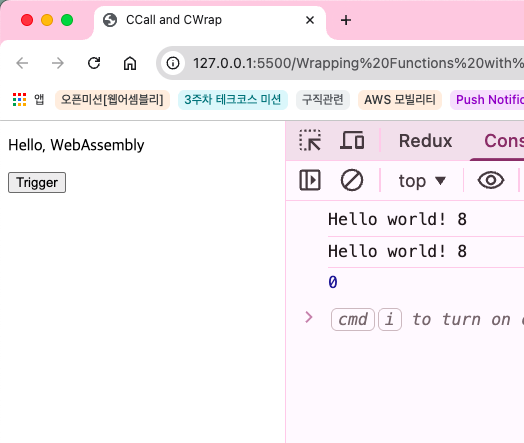
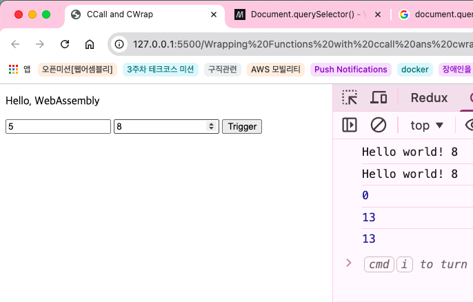
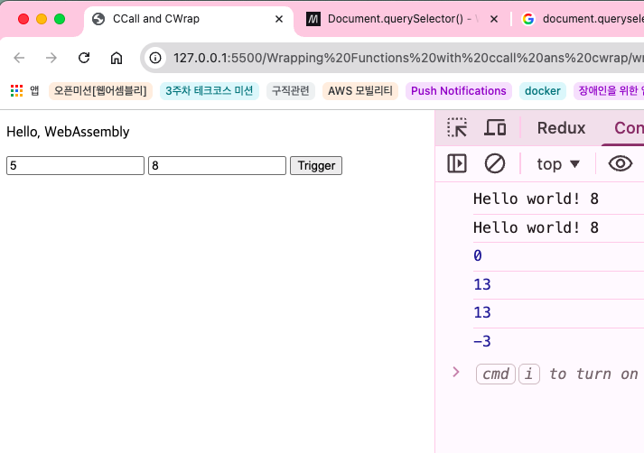

```c
#include <stdio.h>

int main()
{
  printf("Hello world!\n");

  return 0;
}
```


```html
<!DOCTYPE html>
<html lang="en">
<head>
  <meta charset="UTF-8">
  <meta name="viewport" content="width=device-width, initial-scale=1.0">
  <title>CCall and CWrap</title>

  <script src="wrapping.js"></script>
</head>
<body>
  <p>Hello, WebAssembly</p>
</body>
</html>
```





```c
#include <stdio.h>

int addNums(int a, int b)
{
  return a + b;
}

int main()
{
  printf("Hello world! %d\n", addNums(3, 5));

  return 0;
}
```

```html
<!DOCTYPE html>
<html lang="en">
<head>
  <meta charset="UTF-8">
  <meta name="viewport" content="width=device-width, initial-scale=1.0">
  <title>CCall and CWrap</title>

  <script src="wrapping.js"></script>
</head>
<body>
  <p>Hello, WebAssembly</p>
</body>
</html>
```



```c
#include <stdio.h>
#include <emscripten.h>

EMSCRIPTEN_KEEPALIVE

int addNums(int a, int b)
{
  return a + b;
}

EMSCRIPTEN_KEEPALIVE
int main()
{
  printf("Hello world! %d\n", addNums(3, 5));

  return 0;
}
```

## ccall 사용하여 C 모듈 호출
```c
#include <stdio.h>
#include <emscripten.h>

EMSCRIPTEN_KEEPALIVE

int addNums(int a, int b)
{
  return a + b;
}

EMSCRIPTEN_KEEPALIVE
int main()
{
  printf("Hello world! %d\n", addNums(3, 5));

  return 0;
}
```

### html 1
```html
<!DOCTYPE html>
<html lang="en">
<head>
  <meta charset="UTF-8">
  <meta name="viewport" content="width=device-width, initial-scale=1.0">
  <title>CCall and CWrap</title>

  <script src="wrapping.js"></script>
</head>
<body>
  <script>
    function run_wasm() {
      var result = Module.ccall(
        "main",
        "number",
        null,
        null,
      )

      console.log(result); /// main함수 반환 값
    }
  </script>
  <p>Hello, WebAssembly</p>
  <button onClick="run_wasm()">Trigger</button>
</body>
</html>
```



### html 2 cwrap 사용하여 C 모듈 호출

```html
<!DOCTYPE html>
<html lang="en">
<head>
  <meta charset="UTF-8">
  <meta name="viewport" content="width=device-width, initial-scale=1.0">
  <title>CCall and CWrap</title>

  <script src="wrapping.js"></script>
</head>
<body>
  <p>Hello, WebAssembly</p>

  <script>
    var addNums = Module.cwrap(
      "addNums",
      "number",
      ["number", "number"]
    );


    function run_wasm() {
      var result = Module.ccall(
        "main",
        "number",
        null,
        null,
      )

      console.log(result); /// main함수 반환 값
      var a = document.querySelector("#a")?.value;
      var b = document.querySelector("#b")?.value;
      
      result = addNums(a, b);
      console.log(result);

      result = Module.ccall(
        "addNums",
        "number",
        ["number", "number"],
        [a, b]
      );

      console.log(result);
    }

    
  </script>

  <input type="number" id="a">
  <input type="number" id="b">

  <button onClick="run_wasm()">Trigger</button>
</body>
</html>
```




### html 3 cwrap 사용 예시 2
```c
#include <stdio.h>
#include <emscripten.h>

EMSCRIPTEN_KEEPALIVE
int addNums(int a, int b)
{
  return a + b;
}

EMSCRIPTEN_KEEPALIVE
int subNums(int a, int b)
{
  return a - b;
}

EMSCRIPTEN_KEEPALIVE
int main()
{
  printf("Hello world! %d\n", addNums(3, 5));

  return 0;
}
```

```html
<!DOCTYPE html>
<html lang="en">
<head>
  <meta charset="UTF-8">
  <meta name="viewport" content="width=device-width, initial-scale=1.0">
  <title>CCall and CWrap</title>

  <script src="wrapping.js"></script>
</head>
<body>
  <p>Hello, WebAssembly</p>

  <script>
    var addNums = Module.cwrap(
      "addNums",
      "number",
      ["number", "number"]
    );

    var subNums = Module.cwrap(
      "subNums",
      "number",
      ["number", "number"]
    )


    function run_wasm() {
      var result = Module.ccall(
        "main",
        "number",
        null,
        null,
      )

      console.log(result); /// main함수 반환 값
      var a = document.querySelector("#a")?.value;
      var b = document.querySelector("#b")?.value;
      
      result = addNums(a, b);
      console.log(result);

      result = Module.ccall(
        "addNums",
        "number",
        ["number", "number"],
        [a, b]
      );

      console.log(result);

      result = subNums(a, b);
      console.log(result);
    }

    
  </script>

  <input type="number" id="a">
  <input type="number" id="b">

  <button onClick="run_wasm()">Trigger</button>
</body>
</html>
```




## Trouble Shooting 모음

TS(trouble shooting) #1 NO_EXIT_RUNTIME
```bash
emcc wrapping.c -o wrapping.js -s "NO_EXIT_RUNTIME=1 -s EXPORTED_RUNTIME_METHODS=['ccall']"
```

->


```bash
emcc wrapping.c -o wrapping.js -s "EXPORTED_RUNTIME_METHODS=['ccall']"
```
> Emscripten 3.x 부터 `NO_EXIT_RUNTIME`은 default 동작으로 변경됨


